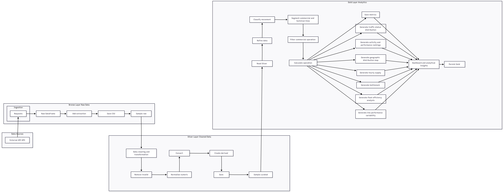

# Projeto de Big Data: Monitoramento da Mobilidade Urbana com Dados de GPS do SPPO/Rio de Janeiro

**Disciplina:** Fundamentos de Big Data  
**Entrega:** AV2 — Projeto Final  
**Tema:** Mobilidade urbana e cidades inteligentes  
**Fonte principal dos dados:** API pública de GPS dos ônibus do SPPO/Rio de Janeiro  
**URL da fonte:** `https://dados.mobilidade.rio/gps/sppo`

**Equipe:** Davi Aleixo, José Guilherme Marinho, Júlia Boto, Júlia Calado, Patrick Catchpole, Vinícius Paz

---

## 1. Introdução

A mobilidade urbana é um dos principais desafios das grandes cidades brasileiras. Em regiões metropolitanas como o Rio de Janeiro, o transporte público por ônibus atende diariamente milhares de pessoas e influencia diretamente o tempo de deslocamento, o acesso ao trabalho, à educação, à saúde e a outros serviços essenciais.

Apesar da importância desse sistema, a operação dos ônibus pode apresentar problemas como atrasos, baixa velocidade média, veículos parados, gargalos viários e concentração irregular da frota em determinadas regiões. Esses fatores afetam a qualidade do serviço oferecido à população e dificultam o planejamento eficiente da mobilidade urbana.

Com a disponibilidade de dados públicos de GPS dos ônibus do Sistema de Transporte Público por Ônibus do Rio de Janeiro (SPPO), torna-se possível analisar a operação do transporte coletivo de forma mais objetiva. Esses dados permitem observar a localização dos veículos, as linhas em circulação, a distribuição espacial da frota, a velocidade registrada e possíveis áreas de lentidão.

Este projeto desenvolve uma solução baseada em Big Data para coletar, tratar, armazenar, analisar e disponibilizar registros de GPS dos ônibus do SPPO/Rio de Janeiro. A proposta transforma dados brutos de localização em indicadores, gráficos, mapas e uma aplicação web interativa para apoiar a compreensão da operação do transporte público urbano.

---

## 2. Motivação

O transporte público impacta diretamente a qualidade de vida da população. Quando o sistema apresenta lentidão, baixa oferta ou distribuição inadequada da frota, os passageiros podem enfrentar maior tempo de espera, viagens mais longas e dificuldade de acesso a atividades essenciais.

A escolha do tema se justifica pela relevância social e prática da mobilidade urbana. A análise de dados de GPS permite acompanhar a operação dos ônibus de forma mais detalhada, identificando padrões de circulação, regiões críticas, linhas com maior quantidade de veículos e pontos de possível lentidão.

Além da importância social, o projeto permite aplicar conceitos fundamentais da disciplina de Fundamentos de Big Data. A solução contempla ingestão de dados, armazenamento em camadas, transformação, limpeza, enriquecimento, carregamento em formato eficiente, geração de indicadores e disponibilização dos resultados por notebooks e aplicação web.

Dessa forma, o projeto une um problema real de interesse público com a aplicação prática de um pipeline de dados, simulando uma solução que poderia apoiar decisões de planejamento urbano, operação de transporte e monitoramento da mobilidade.

---

## 3. Objetivo do Projeto

O objetivo do projeto é desenvolver uma solução baseada em dados para monitorar e analisar a operação dos ônibus do SPPO/Rio de Janeiro, utilizando um pipeline completo de Big Data desde a coleta dos dados até a geração e disponibilização de métricas, mapas e visualizações interativas.

De forma específica, o projeto busca:

- Coletar dados brutos de GPS a partir de uma API pública;
- Armazenar uma amostra da camada bruta para validação e reprodutibilidade;
- Normalizar campos numéricos, coordenadas geográficas e timestamps;
- Criar colunas derivadas para facilitar análises temporais e operacionais;
- Calcular métricas como ônibus ativos, linhas ativas, velocidade média, velocidade mediana e percentual de veículos parados;
- Classificar o movimento dos ônibus em categorias operacionais;
- Construir visualizações gráficas, rankings, mapas e mapa de calor para apoiar a interpretação dos dados;
- Disponibilizar os resultados em uma aplicação web com FastAPI, Leaflet e streaming em tempo real;
- Organizar o projeto em uma estrutura versionável e adequada para entrega no GitHub.

---

## 4. Metodologia (Pipeline de Dados)

A metodologia do projeto foi baseada na construção de um pipeline de dados completo, organizado em cinco etapas principais: fontes de dados, ingestão, transformação, carregamento e destino. A solução também foi estruturada em camadas de dados, seguindo a lógica bronze, silver e gold.

### 4.1 Arquitetura da solução

O fluxo geral do pipeline está representado no diagrama abaixo:



A arquitetura do projeto foi dividida nas seguintes camadas:

| Camada | Função no projeto |
|---|---|
| Bronze | Armazenamento dos dados brutos extraídos da API, preservando a estrutura original. |
| Silver | Dados limpos, normalizados e enriquecidos com novas colunas. |
| Gold | Dados prontos para análise, métricas consolidadas, regras operacionais e visualizações. |
| Aplicação | Disponibilização dos dados tratados em uma interface web interativa com mapa, filtros e rotas da API. |

A organização em camadas facilita a manutenção do projeto, separa as responsabilidades de cada etapa e permite validar o pipeline de forma progressiva. A camada bronze preserva a origem, a silver prepara os dados para análise, a gold consolida os indicadores e a aplicação web transforma os resultados em uma ferramenta de consulta e visualização.

### 4.2 Fontes de dados

A fonte principal utilizada foi a API pública de mobilidade do Rio de Janeiro:

```text
https://dados.mobilidade.rio/gps/sppo
```

A API retorna registros de GPS de ônibus do SPPO. Entre os principais campos utilizados estão:

| Campo | Descrição |
|---|---|
| `ordem` | Identificação do veículo. |
| `latitude` | Latitude informada pelo GPS. |
| `longitude` | Longitude informada pelo GPS. |
| `datahora` | Momento de captura do GPS, originalmente em timestamp Unix em milissegundos na etapa de ingestão. |
| `velocidade` | Velocidade registrada do veículo. |
| `linha` | Linha de ônibus associada ao veículo. |
| `datahoraenvio` | Momento de envio da informação. |
| `datahoraservidor` | Momento de recebimento ou processamento no servidor. |
| `momento_extracao` | Momento em que os dados foram extraídos para o projeto. |

A escolha dessa fonte está alinhada ao objetivo do projeto, pois os dados de GPS permitem analisar a operação dos ônibus em termos de localização, velocidade, oferta de frota e comportamento das linhas.

### 4.3 Ingestão

A etapa de ingestão foi implementada em Python por meio da biblioteca `requests`, utilizada para realizar a requisição HTTP à API pública. Após a resposta da API, os dados em formato JSON foram convertidos para um DataFrame com a biblioteca `pandas`.

No notebook `codigo/notebooks/AV1_bronze_silver.ipynb`, a extração completa registrou **508.468 registros de GPS** em uma execução. Como o arquivo bruto completo possuía aproximadamente **48,84 MB**, foi criada uma amostra com **2.000 linhas** para versionamento no GitHub.

Arquivo versionado da camada bronze:

```text
dados/bronze/amostra_gps_sppo_bruto.csv
```

Essa etapa representa a entrada dos dados no ecossistema do projeto e preserva uma amostra da base original para consulta e validação.

### 4.4 Transformação

A etapa de transformação corresponde à limpeza, padronização e enriquecimento dos dados. Essa fase é essencial para converter registros brutos de GPS em informações adequadas para análise.

As principais transformações realizadas foram:

- Conversão de timestamps Unix em milissegundos para data e hora legíveis;
- Ajuste de fuso horário para `America/Sao_Paulo`;
- Conversão de latitude, longitude e velocidade para formato numérico;
- Substituição de vírgula por ponto em campos decimais;
- Remoção de registros com valores nulos em campos críticos;
- Filtro de coordenadas inválidas ou zeradas;
- Remoção de velocidades negativas;
- Criação de colunas derivadas, como `data`, `hora`, `minuto`, `dia_semana`, `latencia_envio_s` e `latencia_servidor_s`.

A camada silver representa os dados tratados, prontos para análises exploratórias, construção da camada gold e consumo pela aplicação web.

Arquivos versionados da camada silver:

```text
dados/silver/sppo_amostra.csv
dados/silver/sppo_silver.parquet
```

O arquivo `sppo_amostra.csv` contém uma amostra tratada, enquanto o arquivo `sppo_silver.parquet` funciona como base histórica tratada para análises e para a rota histórica da aplicação.

### 4.5 Carregamento

Após a limpeza e normalização, os dados tratados foram carregados em formato CSV e Parquet. O formato Parquet foi escolhido por ser mais eficiente que CSV para armazenamento e leitura em cenários analíticos, principalmente quando há maior volume de dados.

No notebook `codigo/notebooks/AV2_gold.ipynb`, a camada silver é lida com `pyarrow`, passa por filtros adicionais de qualidade e é utilizada para gerar métricas consolidadas. A camada gold também armazena indicadores operacionais em CSV.

Arquivo versionado da camada gold:

```text
dados/gold/resumo_metricas.csv
```

O carregamento consolida os dados transformados em uma camada final de análise, reduzindo a necessidade de repetir todo o processo de limpeza a cada nova visualização.

### 4.6 Destino

O destino final do pipeline é composto por arquivos analíticos, notebooks, gráficos, mapas e uma aplicação web interativa. Os dados tratados ficam disponíveis para consumo por meio das camadas organizadas do projeto e também por endpoints criados em FastAPI.

Os principais produtos finais são:

- Tabelas em CSV e Parquet;
- Métricas operacionais consolidadas;
- Gráficos de velocidade, oferta e distribuição da frota;
- Rankings de linhas por frota e desempenho;
- Mapa de dispersão geográfica;
- Mapa de calor para identificação de lentidão;
- Dashboard web com filtros por linha, rota histórica e ônibus próximos;
- API local com endpoints para consulta de métricas, linhas, rotas, gargalos e streaming de posições.

A aplicação web está localizada na pasta `app/` e disponibiliza uma interface chamada **RIOBUS**, com mapa interativo baseado em Leaflet. O backend em FastAPI consulta a API pública, aplica regras de tratamento e classificação da camada gold e retorna os dados em formato adequado para o frontend.

### 4.7 Regras operacionais da camada gold

Na camada gold, os dados foram enriquecidos com regras operacionais para facilitar a interpretação:

| Regra | Descrição |
|---|---|
| Classificação de movimento | Converte a velocidade em categorias operacionais. |
| Segmentação comercial/técnica | Filtra linhas técnicas, manutenção, treino, vistoria e fora de operação. |
| Deduplicação por veículo | Mantém o registro mais recente de cada veículo para o monitoramento em tempo real. |
| Geração de GeoJSON | Converte os dados tratados para visualização no mapa. |
| Cálculo de proximidade | Usa a fórmula de Haversine para buscar ônibus próximos de uma posição. |
| Mapa de calor | Usa veículos em lentidão para destacar possíveis gargalos urbanos. |

A classificação de movimento segue os seguintes critérios:

| Critério | Classificação |
|---|---|
| `velocidade = 0` | Parado/Garagem |
| `1 <= velocidade <= 15` | Lentidão/Trânsito |
| `velocidade > 15` | Fluído |

### 4.8 Tecnologias utilizadas

| Tecnologia | Uso no projeto |
|---|---|
| Python | Linguagem principal do pipeline e do backend. |
| Jupyter Notebook | Desenvolvimento, exploração e apresentação das análises. |
| Requests | Coleta dos dados via API. |
| Pandas | Manipulação, limpeza e análise dos dados. |
| NumPy | Apoio a operações numéricas e categorização. |
| PyArrow | Leitura e escrita de arquivos Parquet. |
| Fastparquet | Suporte adicional ao formato Parquet. |
| Matplotlib | Geração de gráficos. |
| Seaborn | Visualizações estatísticas nos notebooks. |
| Folium | Construção de visualizações geográficas nos notebooks. |
| FastAPI | Backend da aplicação web e rotas da API local. |
| Uvicorn | Servidor ASGI para execução da aplicação FastAPI. |
| Cachetools | Cache temporário do snapshot da API para evitar sobrecarga. |
| Leaflet | Mapa interativo no frontend web. |
| HTML, CSS e JavaScript | Interface visual, filtros, mapa e interação com o usuário. |
| Server-Sent Events (SSE) | Streaming de posições em tempo real para o mapa. |

### 4.9 Organização do repositório

A estrutura atual do projeto no ZIP está organizada da seguinte forma:

```text
big_data_proj-main/
├── app/
│   ├── app.py
│   ├── core/
│   │   └── gold.py
│   ├── services/
│   │   ├── cache.py
│   │   ├── fetcher.py
│   │   └── processor.py
│   ├── static/
│   │   └── map.js
│   └── templates/
│       └── index.html
├── codigo/
│   ├── notebooks/
│   │   ├── AV1_bronze_silver.ipynb
│   │   ├── AV2_gold.ipynb
│   │   └── gold/
│   │       └── .gitkeep
│   └── testes/
│       ├── test.py
│       └── test_fetcher.py
├── dados/
│   ├── bronze/
│   │   └── amostra_gps_sppo_bruto.csv
│   ├── silver/
│   │   ├── sppo_amostra.csv
│   │   └── sppo_silver.parquet
│   └── gold/
│       └── resumo_metricas.csv
├── documentacao/
│   └── diagrama_pipeline.png
├── .gitignore
├── README.md
└── requirements.txt
```

---

## 5. Resultados e Visualizações

A camada gold consolida a análise operacional dos ônibus a partir dos dados tratados. Em uma execução analisada, foram obtidos os seguintes indicadores:

| Indicador | Resultado |
|---|---:|
| Registros carregados | 508.468 |
| Registros operacionais comerciais | 493.017 |
| Ônibus ativos | 3.836 |
| Linhas ativas | 370 |
| Velocidade média | 15,85 km/h |
| Velocidade mediana | 13,00 km/h |
| Percentual de veículos parados | 28,84% |

Esses indicadores mostram que os dados de GPS permitem acompanhar a operação do sistema de ônibus de forma quantitativa, possibilitando observar a frota ativa, as linhas em circulação e a condição geral de deslocamento dos veículos. Como a API é dinâmica, esses números representam uma execução específica do pipeline e podem variar conforme o momento da coleta.

### 5.1 Snapshot operacional

O arquivo `dados/gold/resumo_metricas.csv` registra snapshots de métricas da operação, incluindo timestamp, ônibus ativos, linhas ativas, velocidade média, velocidade mediana e percentual de veículos parados.

Esse arquivo permite acompanhar a evolução das métricas ao longo de execuções sucessivas do pipeline e funciona como uma base resumida para gráficos temporais.

### 5.2 Rankings operacionais

O notebook da camada gold gera rankings para apoiar a análise das linhas, incluindo:

- top 10 linhas com maior frota;
- top 10 linhas mais lentas por velocidade média;
- top 10 linhas mais rápidas por velocidade média.

Esses rankings ajudam a identificar quais linhas concentram mais veículos e quais apresentam desempenho operacional mais crítico. A análise pode ser usada como ponto de partida para investigar gargalos, horários de pico ou trechos com recorrência de baixa velocidade.

### 5.3 Curva de oferta por horário

Foi construída uma curva de oferta com a quantidade de veículos únicos em operação por hora. Essa visualização permite observar a disponibilidade da frota ao longo do dia e avaliar possíveis quedas de oferta em determinados horários.

A curva de oferta contribui para compreender a dinâmica temporal do sistema, especialmente quando comparada com períodos de maior demanda da população.

### 5.4 Mapa de distribuição geográfica

A distribuição dos ônibus foi visualizada por meio de gráficos e mapas com latitude e longitude. Essa análise permite observar a cobertura espacial da operação e identificar regiões com maior concentração de veículos.

A visualização geográfica é importante porque os dados de mobilidade não dependem apenas de indicadores agregados. A localização dos veículos permite compreender como a frota está distribuída no território urbano.

### 5.5 Mapa de calor de gargalos

Foi criado um mapa de calor com foco nos veículos em baixa velocidade, considerando ônibus com velocidade maior que 0 e menor ou igual a 15 km/h. Essa visualização indica áreas com maior concentração de lentidão.

O mapa de calor pode apoiar discussões sobre faixas exclusivas, priorização semafórica, intervenções viárias e ajustes operacionais em regiões com maior concentração de baixa velocidade.

### 5.6 Aplicação web e dashboard interativo

Além dos notebooks, o projeto inclui uma aplicação web na pasta `app/`. A aplicação transforma a análise em uma interface interativa para consulta e visualização da operação dos ônibus.

A interface web permite:

- visualizar ônibus no mapa em tempo real;
- filtrar uma linha específica;
- listar linhas ativas;
- consultar métricas gerais da operação;
- visualizar uma nuvem de pontos históricos de uma linha a partir do arquivo Parquet da camada silver;
- buscar ônibus próximos a uma localização informada ou simulada no mapa;
- exibir mapa de calor com pontos de lentidão;
- receber atualizações por streaming usando Server-Sent Events.

As principais rotas da aplicação são:

| Rota | Finalidade |
|---|---|
| `/` | Página principal com o mapa interativo. |
| `/api/snapshot` | Métricas gerais da operação. |
| `/api/linhas` | Lista de linhas ativas. |
| `/api/linha/{numero}` | Posição atual dos ônibus de uma linha específica. |
| `/api/rota/{numero}` | Nuvem de pontos históricos de uma linha a partir da camada silver. |
| `/api/proximos` | Ônibus próximos de uma latitude/longitude em determinado raio. |
| `/api/mapa-calor` | Pontos de gargalo para heatmap. |
| `/api/stream` | Streaming de posições em tempo real. |
| `/api/status` | Verificação de funcionamento da aplicação e disponibilidade da camada silver. |

Essa aplicação amplia o storytelling do projeto, pois permite que o usuário explore os dados de forma dinâmica, selecione linhas específicas e observe a distribuição espacial dos veículos conforme a classificação de movimento.

---

## 6. Conclusões

O projeto demonstrou a aplicação prática de um pipeline de Big Data em um problema real de mobilidade urbana. A solução coletou dados brutos de GPS, realizou limpeza e transformação, armazenou os dados tratados, gerou análises com foco na operação dos ônibus do SPPO/Rio de Janeiro e disponibilizou parte dos resultados em uma aplicação web interativa.

A partir das métricas e visualizações produzidas, foi possível observar a quantidade de ônibus ativos, linhas em operação, velocidade média da frota, percentual de veículos parados e concentração geográfica de lentidão. Esses resultados mostram como dados públicos podem ser utilizados para apoiar decisões relacionadas ao planejamento urbano e à melhoria do transporte público.

Assim, o projeto cumpre o objetivo de transformar dados brutos em informações úteis, aplicando conceitos de ingestão, transformação, carregamento, armazenamento, visualização e disponibilização de dados dentro de um pipeline completo de Big Data.

### 6.1 Análise crítica dos resultados

O pipeline desenvolvido atende ao objetivo de transformar dados brutos de GPS em informações analíticas para mobilidade urbana. A organização em camadas facilita a manutenção do projeto e permite que cada etapa seja validada separadamente.

A análise mostra que os dados de GPS podem gerar indicadores relevantes para compreender a operação do sistema de ônibus, especialmente velocidade média, oferta de veículos, linhas ativas, veículos parados e regiões com lentidão. As visualizações tornam os resultados mais acessíveis e favorecem a apresentação dos principais achados do projeto.

A aplicação web representa um avanço importante em relação a uma análise puramente estática, pois disponibiliza os dados em uma interface de consulta com mapa, filtros e atualização em tempo real. Isso aproxima o projeto de uma solução prática de monitoramento urbano.

Entretanto, os resultados precisam ser interpretados considerando as limitações da base. Como os dados da API são dinâmicos, os indicadores podem variar conforme o momento da coleta. Além disso, a análise utiliza registros de GPS, mas não incorpora diretamente informações de demanda de passageiros, ocorrências de trânsito, clima, acidentes ou eventos urbanos, fatores que poderiam explicar parte das variações de velocidade e distribuição da frota.

Outro ponto importante é que a amostra versionada no repositório facilita a entrega e evita arquivos muito grandes no GitHub, mas não substitui uma base histórica completa. Para análises mais profundas, seria necessário coletar dados continuamente ao longo de dias, semanas ou meses.

### 6.2 Dificuldades encontradas

Durante o desenvolvimento, as principais dificuldades foram:

- Tratamento de timestamps Unix em milissegundos;
- Padronização de latitude e longitude com separadores decimais diferentes;
- Controle do tamanho dos arquivos para evitar versionamento de bases muito grandes;
- Ajuste dos caminhos de arquivos entre ambiente local e Google Colab;
- Organização das etapas do pipeline em camadas compreensíveis;
- Construção de visualizações geográficas com muitos pontos de GPS;
- Integração entre notebooks, arquivos Parquet e aplicação FastAPI;
- Definição de critérios simples e interpretáveis para classificar o movimento dos ônibus;
- Uso de cache e streaming para evitar sobrecarga da API e melhorar a experiência no mapa.

Essas dificuldades foram tratadas com conversões explícitas de tipos, validações de qualidade, uso de arquivos amostrais para versionamento, separação do pipeline em camadas bronze, silver e gold, e criação de funções no backend para reaproveitar as regras da camada gold.

### 6.3 Trabalhos futuros

Como evolução do projeto, podem ser implementadas as seguintes melhorias:

- automatizar a coleta em intervalos regulares para criar uma série histórica mais robusta;
- armazenar os dados em banco NoSQL, banco geoespacial ou data lake em nuvem;
- publicar a aplicação web em ambiente externo;
- criar autenticação e logs para uso operacional da aplicação;
- comparar o desempenho das linhas por dia da semana e horário de pico;
- integrar dados climáticos, acidentes, eventos urbanos ou informações de trânsito;
- criar alertas automáticos para regiões com lentidão recorrente;
- implementar testes automatizados mais completos para validação do pipeline e da API;
- padronizar variáveis de caminho para facilitar execução local, em Colab e em servidor;
- aplicar modelos preditivos para estimar lentidão ou disponibilidade da frota em determinados horários.

---

## Referências

PREFEITURA DO RIO DE JANEIRO. API pública de dados de mobilidade — GPS SPPO. Disponível em: `https://dados.mobilidade.rio/gps/sppo`.

PANDAS. Documentação oficial. Disponível em: `https://pandas.pydata.org/docs/`.

APACHE ARROW. Documentação oficial do PyArrow. Disponível em: `https://arrow.apache.org/docs/python/`.

FASTAPI. Documentação oficial. Disponível em: `https://fastapi.tiangolo.com/`.

LEAFLET. Documentação oficial. Disponível em: `https://leafletjs.com/`.

FOLIUM. Documentação oficial. Disponível em: `https://python-visualization.github.io/folium/`.

MATPLOTLIB. Documentação oficial. Disponível em: `https://matplotlib.org/`.
